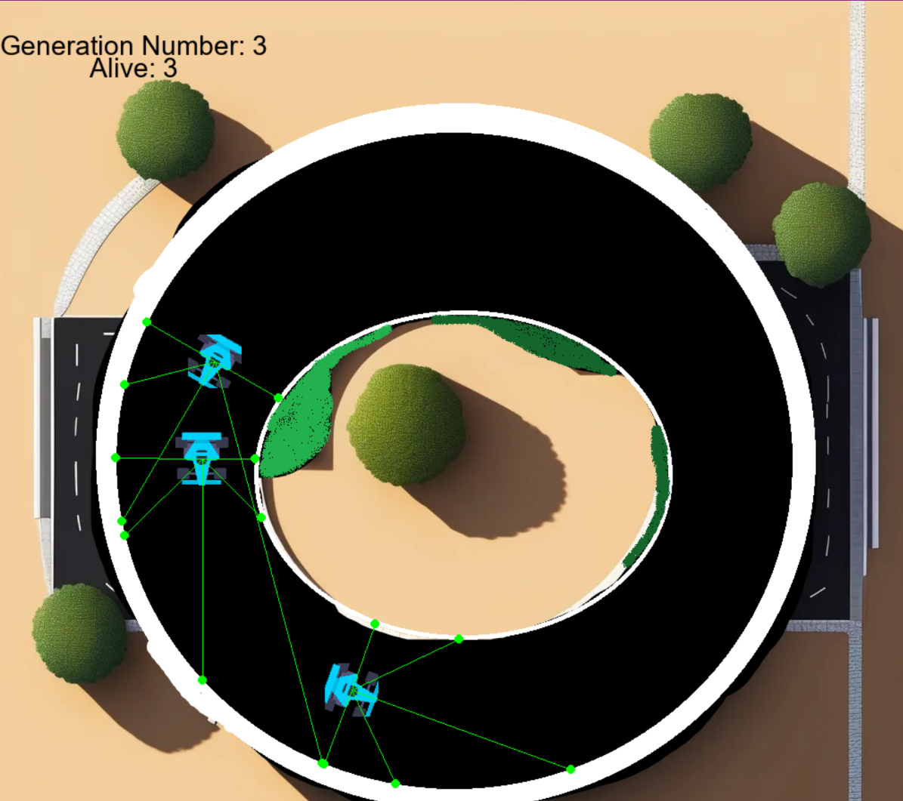
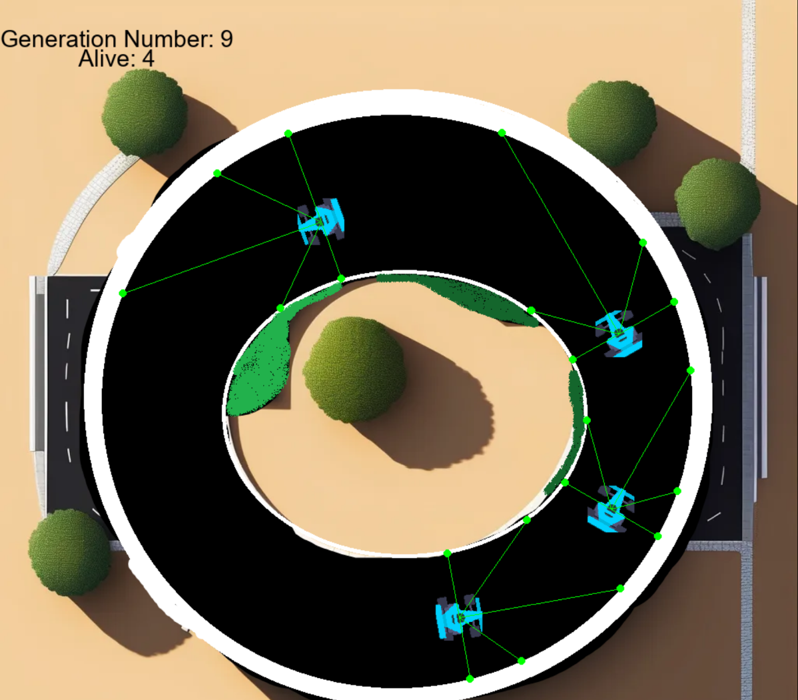

# NeuralNetworkCars

Usage of the genetic algorithm to train generations of 30 cars over time, using NeuroEvolution of Augmenting Topologies (NEAT) to train and evolve neural networks to produce the best survivability of cars on a track.
Used PyGame to visualise and make the car game, which NEAT uses to train the car sprites.
Over time, better genetic models are reproduced, leading to better fitness in future generations.

